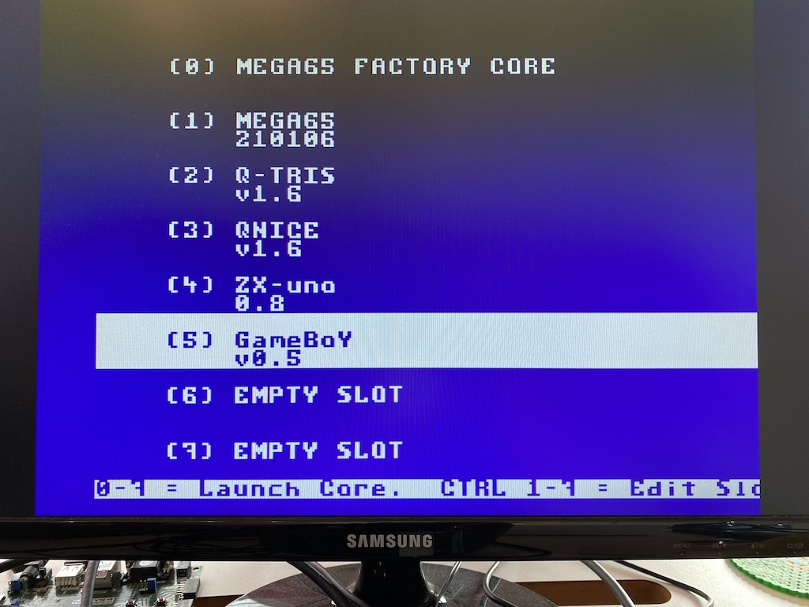
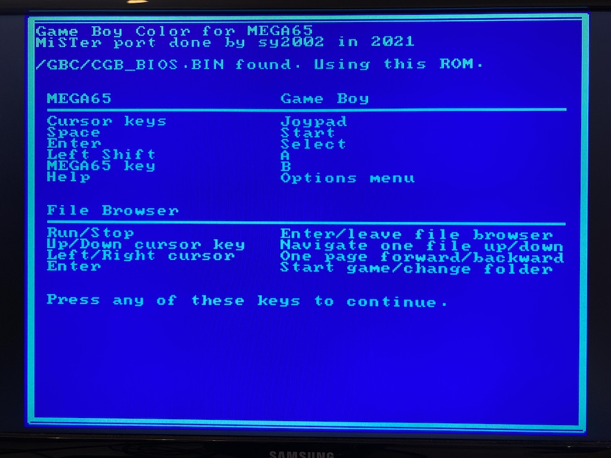

Game Boy and Game Boy Color for MEGA65
======================================

Play [Game Boy](https://en.wikipedia.org/wiki/Game_Boy) and
[Game Boy Color](https://en.wikipedia.org/wiki/Game_Boy_Color) games on your
[MEGA 65](https://mega65.org/)!
[Download](bin) the bitstream and the core file for your R2 or R3 machine
from the [bin](bin) folder.

**WARNING: Alpha version 0.5 - See constraints below**

This core is based on the
[MiSTer](https://github.com/MiSTer-devel/Gameboy_MiSTer) Game Boy core which
itself is based on the
[MiST](https://github.com/mist-devel/gameboy) Game Boy core.

[sy2002](http://www.sy2002.de) ported the core to the MEGA65 in 2021.

Special thanks to [Robert Peip](https://github.com/RobertPeip)
for his invaluable support.

The core uses [QNICE-FPGA](https://github.com/sy2002/QNICE-FPGA) for
loading the Game Boy's BIOS as well as for the on-screen-menu and for
loading game roms.

Installation
------------

1. [Download](bin) the bitstream and the core file for your R2 or R3 machine
   from the [bin](bin) folder.
2. Either use MEGA65's bitstream utility or install the core file so that you
   can use MEGA65's <kbd>No Scroll</kbd> boot menu to load the core.
3. The core needs a FAT32 formatted SD card to load game roms.
4. If you put your ROMs into a folder called `/gbc`, then the core will
   display this folder on startup.
5. The core includes an Open Source Game Boy BIOS. For more authenticity,
   go to https://gbdev.gg8.se/files/roms/bootroms/ and and download
   `dmg_boot.bin` and `cgb_bios.bin` and place both in the `/gbc` folder.

Constraints of the current Alpha version 0.5
--------------------------------------------

* Only plays 32kB ROM files and some selected 64kB ROM files such as
  Super Mario Land 1, QIX and Castlevania 1
* VGA 800x600 @ 60 Hz and audio via 3.5mm audio jack - no HDMI
* No joystick support
* No options menu, yet (no configuration possibilities such as
  "switch to Game Boy classic without color", palette switching, ...)

Some demo pictures
------------------

|       |      |        | 
|:----------------------------:|:---------------------------:|:-----------------------------:| 
| *MEGA65 Core Selection*      | *Game Boy Core: Start*      | *Game Boy Core: File Browser* |
|       |      |        | 
| *Game Boy Color Boot Screen* | *Super Mario Start Screen*  | *Super Mario Gameplay Screen* |

Clarification: These screenshots are just for illustration purposes. This repository does not
contain any copyrighted ROMs such as BIOS ROMs or game ROMs.

# ORIGINAL MiSTer README.md text

**TODO: Take what is needed for MEGA65 and delete the rest**

This is port of [Gameboy for MiST](https://github.com/mist-devel/mist-board/tree/master/cores/gameboy)

* Place RBF file into root of SD card.
* Place *.gb files into Gameboy folder.

## Features
* Original Gameboy & Gameboy Color Support
* Super Gameboy Support - Borders, Palettes and Multiplayer
* SaveStates
* Fastforward 
* Rewind - Allows you to rewind up to 40 seconds of gameplay
* Frameblending - Prevents flicker in some games (e.g. "Chikyuu Kaihou Gun Zas") 
* Custom Palette Loading
* Gameboy Link Port Support - Requires USERIO adapter
* Cheats

## Open Source Bootstrap roms
This now includes the open source boot ROMs from [https://github.com/LIJI32/SameBoy/](https://github.com/LIJI32/SameBoy/) (for maximum GBC compatibility/authenticity you can still place the Gameboy color bios/bootrom into the Gameboy folder and rename it to boot1.rom)

## Palettes
Core supports custom palettes (*.gbp) which should be placed into Gameboy folder. Some examples are available in palettes folder.

## Autoload
To autoload custom palette at startup rename it to boot0.rom
To autoload favorite game at startup rename it to boot2.rom

## Video output
The Gameboy can disable video output at any time which causes problems with vsync_adjust=2 or analog video during screen transitions. Enable the Stabilize video option to fix this at the cost of some latency.

